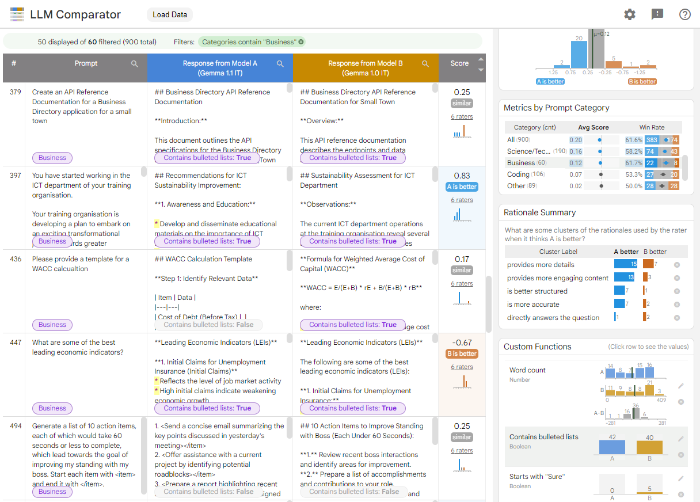

# LLM Comparator

LLM Comparator is an interactive visualization tool with a python library, for
analyzing side-by-side LLM evaluation results.
It is designed to help people qualitatively analyze how
responses from two models differ at example- and slice-levels. Users can
interactively discover insights like *"Model A's responses are better than B's
on email rewriting tasks because Model A tends to generate bulleted lists more
often."*




## Using LLM Comparator

You can play with LLM Comparator at https://pair-code.github.io/llm-comparator/.

You can either select one of the example files we provide, or you can upload
your own JSON file (e.g.,
[minimal example file](https://pair-code.github.io/llm-comparator/data/example_tiny.json))
that follows our format which we describe below.


## Example Demo for Comparing Gemma 1.1 and 1.0

We provide an example file for comparing
the model responses between [Gemma](https://ai.google.dev/gemma) 1.1 and 1.0
for prompts obtained from the
[Chatbot Arena Conversations dataset](https://huggingface.co/datasets/lmsys/chatbot_arena_conversations).
You can click the link below to play with it:
https://pair-code.github.io/llm-comparator/?results_path=https://pair-code.github.io/llm-comparator/data/example_arena.json

The tool helps you analyze *when* and *why* Gemma 1.1 is better or worse than
1.0 and *how* responses from two models differ.

- ***When***: The **Score Distribution** and **Metrics by Prompt Category**
panels show that the quality of responses from Model A (Gemma 1.1) is considered
better than that from Model B (Gemma 1.0) (larger blue area than orange; >50%
win rate), according to the LLM-based evaluation method
([LLM-as-a-judge](https://arxiv.org/abs/2306.05685)).
This holds true for most prompt categories (e.g., Humanities, Math).
- ***Why***: The **Rationale Summary** panel dives into the reasons behind these
score differences.
In this case, the LLM judge focused mostly on the amount of details. It also
considered factors like conciseness, engagement, structures, etc.
- ***How***: The **Custom Functions** panel lets you discover interesting
specific differences.
For instance, Gemma 1.1 (Model A) is more structured in a sense that
it uses bulleted lists more frequently. Also, Gemma 1.1 is less chatty.
While there are many responses starting with "Sure" for Gemma 1.0, no response
from Gemma 1.1 starts with it.


## Python Library for Creating JSON File

This project provides the `llm-comparator` package on PyPI, which create JSON
files for use with the LLM Comparator visualization. This package can create the
entire JSON file, including side-by-side LLM-based evaluation and rationale
clusters, given a set of input prompts to run and models to run them on. Or, if
a user already has prompts and an existing set of model outputs, it can perform
just the rationale clustering steps. You can simply run a notebook to create a
JSON file and see the results at
[basic_demo.ipynb](python/notebooks/basic_demo.ipynb).
For more details, see the
[Python library README](python/README.md).


## JSON Data Format

The LLM Comparator tool takes a JSON file and visualizes its content. The file
must follow the schema described below.


### Minimal Example

We assume that a user has a set of input prompts to test. For each prompt, they
need to prepare the responses to the prompt from two LLMs (i.e., Model A, Model
B), and a numerical score obtained from side-by-side evaluation (e.g.,
[LLM-as-a-judge](https://arxiv.org/abs/2306.05685),
[AutoSxS](https://cloud.google.com/vertex-ai/generative-ai/docs/models/side-by-side-eval)).
A positive score represents that A's response is better than B's; a negative
score indicates B is better; and zero meaning a tie.
We assume that the scores are in the range of 1.5 to -1.5.

The data file should be formatted like below.
All the fields presented below are required.

```
{
    "metadata": {
        "source_path": "Any string for your records (e.g., run id)",
        "custom_fields_schema": []
    },
    "models": [
        {"name": "Short name of your first model"},
        {"name": "Short name of your second model"}
    ],
    "examples": [
        {
            "input_text": "This is a prompt.",
            "tags": ["Math"],  # A list of keywords for categorizing prompts
            "output_text_a": "Response to the prompt from the first model (A)",
            "output_text_b": "Response to the prompt from the other model (B)",
            "score": -1.25,  # Score from the judge LLM
            "individual_rater_scores": [],
            "custom_fields": {}
        },
        {
            "input_text": "This is a next prompt.",
            ...
        }
    ]
}
```

### Additional Data

You can optionally provide additional information to be analyzed in LLM
Comparator.

#### Custom Fields

If you have additional information about each prompt, it can be displayed as
columns in the table and aggregated information is visualized as charts
on the right side of the interface. It supports various data types, such as:

- `number`: Numeric data, visualized as histograms (e.g., word count for prompt,
    safety score computed from an external API).
- `category`: Categorical data in string, visualized as bar charts (e.g., name
    of data sources for prompt).
- `text`: For long text (rendered with scrollable holders).
- `string`: Generic string (can be used for ID key).
- `image_path`: For image url.
- `image_byte`: Raw image byte string in base64 encoding of jpeg.

The tool also supports cases when you have values obtained from each of the two
model responses. We call these as `per_model` types, including:

- `per_model_boolean`: Boolean value applied to each response (e.g., whether
    containing bulleted lists).
- `per_model_number`: Numeric value from each response (e.g., word count).
- `per_model_category`: Categorical strings applied to each response (e.g.,
    tone of text).

This information can be formatted like this:

```
{
	"metadata": {
		"source_path": "...",
		"custom_fields_schema": [
			{"name": "prompt_word_count", "type": "number"},
			{"name": "word_overlap_rate_between_a_b", "type": "number"},
			{"name": "data_source", "type": "category"},
			{"name": "unique_id", "type": "string"},
			{"name": "is_over_max_token", "type": "per_model_boolean"},
			{"name": "TF-IDF_between_prompt_and_response", "type": "per_model_number"},
			{"name": "writing_style", "type": "per_model_category"},
		]
	},
	"models": [{...}, {...}],
	"examples": [
		{
			"input_text": "Which city should I visit in South Korea?",
			"tags": ["Travel"],
			"output_text_a": "You can visit Seoul, the capital of South Korea.",
			"output_text_b": "You can visit Seoul, Busan, and Jeju.",
			"score": 0.5,
			"individual_rater_scores": [],
			"custom_fields": {
				"prompt_word_count": 8,
				"word_overlap_rate_between_a_b": 0.61,
				"data_source": "XYZ",
				"unique_id": "abc000",
				"is_over_max_token": [true, false],
				"TF-IDF_between_prompt_and_response": [0.31, 0.15],
				"writing_style": ["Verbose", "Neutral"]
			}
		},
		{
            "input_text": "How to draw bar charts using Python?",
            ...
```

#### Individual Ratings

LLM-based automatic side-by-side evaluation is often repeated multiple times.
It is due to two factors: position bias, where the order of two model responses
can influence results, and non-deterministic sampling, where varying model
responses occur with non-zero temperature settings.

LLM Comparator can display the detailed information on individual runs. This
allows users to analyze score distribution and rationales used by the LLM judge.

This information can be embedded in the `individual_rater_scores` property like
below:

```
{
    "metadata": [
        "source_path": "...",
        "custom_fields_schema": [],
    ]
    "models": [
        {"name": "Gemma 1.1"},
        {"name": "Gemma 1.0"},
    ],
    "examples": [
        {
            "input_text": "Which city should I visit in South Korea?",
			"tags": ["Travel"],
			"output_text_a": "You can visit Seoul, the capital of South Korea.",
			"output_text_b": "You can visit Seoul, Busan, and Jeju.",
			"score": 0.5,
            "individual_rater_scores": [
                {
                    "is_flipped": false,
                    "score": 1.5,
                    "rationale": "A describes more information about ...",
                },
                {
                    "is_flipped": false,
                    "score": -0.5,
                    "rationale": "While A provides one option, B gives ...",                }
            ],
            "custom_fields": {},
        },
        {
            "input_text": "How to draw bar charts using Python?",
            ...
        }
    ]
}
```

## Local Development with LLM Comparator

```shell
git clone https://github.com/PAIR-code/llm-comparator.git
cd llm-comparator
npm install
npm run build
npm run serve
```


## Citing LLM Comparator

If you use or refer to LLM Comparator in your work, please cite our research
paper presented at IEEE VIS 2024, [published in IEEE TVCG](https://doi.org/10.1109/TVCG.2024.3456354).

```
@article{kahng2025comparator,
    title={{LLM Comparator}: Interactive Analysis of Side-by-Side Evaluation of Large Language Models},
    author={Kahng, Minsuk and Tenney, Ian and Pushkarna, Mahima and Liu, Michael Xieyang and Wexler, James and Reif, Emily and Kallarackal, Krystal and Chang, Minsuk and Terry, Michael and Dixon, Lucas},
    journal={IEEE Transactions on Visualization and Computer Graphics},
    year={2025},
    volume={31},
    number={1},
    publisher={IEEE},
    doi={10.1109/TVCG.2024.3456354}
}
```

A prelinimary version was presented at ACM CHI 2024 in the Late-Breaking Work
track, also available on arXiv (https://arxiv.org/abs/2402.10524).

```
@inproceedings{kahng2024comparator,
    title={{LLM Comparator}: Visual Analytics for Side-by-Side Evaluation of Large Language Models},
    author={Kahng, Minsuk and Tenney, Ian and Pushkarna, Mahima and Liu, Michael Xieyang and Wexler, James and Reif, Emily and Kallarackal, Krystal and Chang, Minsuk and Terry, Michael and Dixon, Lucas},
    booktitle={Extended Abstracts of the CHI Conference on Human Factors in Computing Systems},
    year={2024},
    publisher={ACM},
    doi={10.1145/3613905.3650755},
    url={https://arxiv.org/abs/2402.10524}
}
```

## Disclaimer

This is not an official Google product.

LLM Comparator is a research project under active development by a small team.
There will be some bugs, but we are releasing at an early stage because we think
it is pretty useful already.
